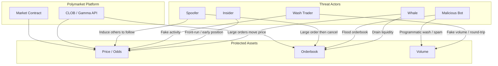

## 1. Scope and Objectives

- **System**: Polymarket prediction markets (e.g. 2024 US Presidential Election market)
- **Assets**: Odds/prices, order book, volume, user behaviour data
- **Goal**: Define “who are the potential manipulators” and provide the basis for anomaly-detection rules (Spec)

---

## 2. Threat Model Diagram

The diagram below describes **who** may manipulate the market, **how**, and **what** is affected.

**Legend**:
- **Whale**: Large capital; a single order can move price or drain the book.
- **Insider**: Has non-public information (e.g. polls, internal decisions); builds or closes positions early.
- **Wash Trader**: Multiple accounts or colluding parties trade with each other to create fake volume and “activity”.
- **Malicious Bot**: Programmatic flood of orders/cancels in a short time; distorts order book or volume.
- **Spoofer**: Places large orders to create false impression, then cancels before fill to induce others.

---

## 3. Threats and Attack Vectors (Summary)

| Threat | Description | Observable signal (for Spec) |
|--------|-------------|-----------------------------|
| **Wash Trading** | Round-trip between accounts under same control; inflated volume, price barely moves | Two accounts are counterparties ≥ N times in 1 minute; price change below threshold |
| **Volume Spike** | Volume in a period surges vs history; may be pump/dump or event-driven | Minute volume > recent N× (e.g. 10×) and price change in that minute ≥ 2% |
| **Spread Manipulation** | Bid-ask spread suddenly widens; liquidity dry or intentional cancels | Spread > historical quantile (e.g. 95%) |
| **Whale Move** | One or a few large orders move price sharply | Single trade dominates period volume and price move > threshold |
| **Spoofing** | Large order placed then quickly cancelled; fake demand/supply | Large order fully cancelled within short window (e.g. 1 min) without fill |

---

## 4. Mapping to project

- The “observable signals” above map directly to **Gherkin Spec** Given-When-Then scenarios.
- The quantitative analyst can implement metrics such as `calculate_volatility()`, spread, and volume spike from these.
- The visualization/validation role can run Ground Truth checks (news/Twitter) on dates flagged as anomalous.

